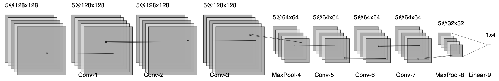

# Cosmological Parameter Inference Using Deep Learning on Simulated Weak Lensing Maps - Master's Dissertation Project
### Author: Diego M. Fernández

## Abstract

In this research, we produce a novel deep learning usage of the cosmo-SLICS suite of weak lensing simulations, and analyze model performance in the prediction of cosmological parameters. We aim to improve predictive accuracy on these noise-free maps by exploring various convolutional neural network architectures and hyperparameters, varying the number of layers, learning rates, and number of inputted cosmological parameters. This report concludes by recommending our preferred architecture for future studies, which yielded 98.50% test accuracy on the S8 parameter. This indicates that deep learning cosmic shear analysis has the potential to outperform the standard two-point weak lensing statistical methods in cosmological parameter constraint.

<!-- ## Overview | Background | Motivation -->

<!-- ## Navigating This Repository -->

## Data Breakdown - The cosmo-*SLICS* Suite of Simulations

The suite of simulations used in this study, cosmo-*SLICS*, consists of N-body simulations of 25 *w*CDM cosmological models, varying Ω~m~, S~8~, h, and w~0~ within reasonable range of the Λ-CDM expected cosmology, alongside a fiducial cosmology – the cosmology representing the standard Λ-CDM model, with a fixed value of w~0~ = −1. The dataset is made up of 5 tomographic redshift bins: z = 0.1-0.3, 0.3-0.5, 0.5-0.7, 0.7-0.9, and 0.9-1.1. This redshift bin distribution matches the distribution found in the KiDS-1000 data release, which allows for broader future use of the developed deep learning models.

The simulations produced cosmological maps for the 26 unique cosmologies in the form of 128x128 pixel arrays distributed across a 5 degree by 5 degree space for 5 redshift bins, with unit-less values roughly between -1 and +1 at each point. These simulations produce Kappa maps – maps that use the shear signal to infer projected matter density onto a 2D plane along the line of sight. Kappa maps differ from shear (or ellipticity) maps in that they cannot be directly observed, but instead must be calculated from shear maps via a set of Fourier transformations. They depict under-densities as negative values and over- densities as positive values; in Figure 4, the bright spots represent the over-densities and the dark spaces represent cosmic voids.

### Optimal Model Architecture & Parameters

## Conclusion

This work implemented novel deep learning analysis on the cosmo-SLICS weak lensing maps with the objective of producing high accuracy convolutional neural networks trained on a set of four cosmological parameters (S~8~ , Ω~m~ , h, and w~0~ ). Thorough testing yielded a CNN that predicted with 97.07% confidence on the S~8~ parameter when trained with the four cosmological parameters. This led to two parameter training exclusively on S~8~ and Ω~m~, which produced a best accuracy prediction on S~8~ of 98.50%. This result reinforced the knowledge that S~8~ and Ω~m~ have more significance in the use of weak lensing maps for cosmological parameter inference. The results of this research allowed for the proposal of a great deal of future work, suggesting that deep learning cosmic shear analysis has the potential to outperform traditional weak lensing statistical methodology used in cosmological parameter constraint.

#

#### Advisors
- Catherine Heymans | Astronomer Royal for Scotland | Professor @ The University of Edinburgh
- Benjamin Giblin | Research Fellow at the University of Edinburgh

#### Data Source
- [Cosmo-*SLICS* Suite of Simulations](https://arxiv.org/abs/1905.06454)

#### Citations
- Citations can be found in the [academic paper](project_academic_paper.pdf) produced for this project
