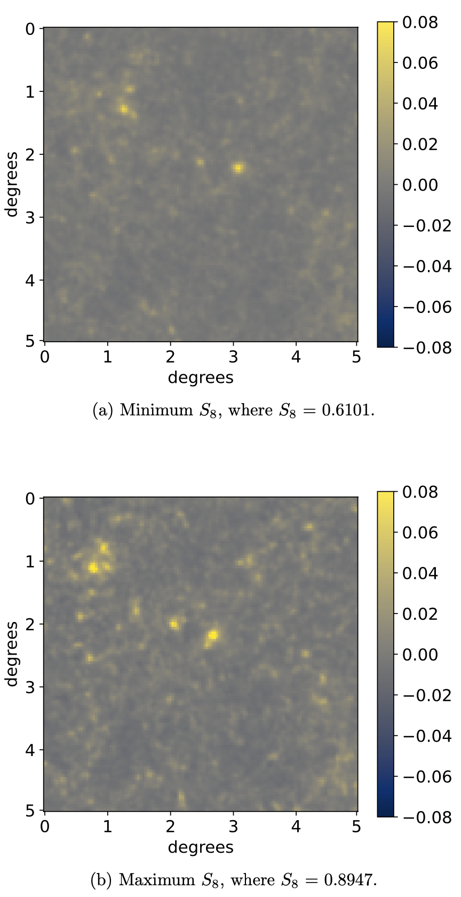

# Cosmological Parameter Inference Using Deep Learning on Simulated Weak Lensing Maps - Master's Dissertation Project
### Author: Diego M. Fernández

## Abstract

In this research, we produce a novel deep learning usage of the cosmo-SLICS suite of weak lensing simulations, and analyze model performance in the prediction of cosmological parameters. We aim to improve predictive accuracy on these noise-free maps by exploring various convolutional neural network architectures and hyperparameters, varying the number of layers, learning rates, and number of inputted cosmological parameters. This report concludes by recommending our preferred architecture for future studies, which yielded 98.50% test accuracy on the S8 parameter. This indicates that deep learning cosmic shear analysis has the potential to outperform the standard two-point weak lensing statistical methods in cosmological parameter constraint.

## Overview | Background | Motivation

## Navigating This Repository

## Data Breakdown

<!-- 

 -->

### Optimal Model Architecture & Parameters

[

## Conclusion

This work implemented novel deep learning analysis on the cosmo-SLICS weak lensing maps with the objective of producing high accuracy convolutional neural networks trained on a set of four cosmological parameters (S8 , Ωm , h, and w0 ). Thorough testing yielded a CNN that predicted with 97.07% confidence on the S8 parameter when trained with the four cosmological parameters. This led to two parameter training exclusively on S8 and Ωm, which produced a best accuracy prediction on S8 of 98.50%. This result reinforced the knowledge that S8 and Ωm have more significance in the use of weak lensing maps for cosmological parameter inference. The results of this research allowed for the proposal of a great deal of future work, suggesting that deep learning cosmic shear analysis has the potential to outperform traditional weak lensing statistical methodology used in cosmological parameter constraint.

#

#### Advisors
- Catherine Heymans | Astronomer Royal for Scotland | Professor @ The University of Edinburgh
- Benjamin Giblin | Research Fellow at the University of Edinburgh

#### Data Source
- [Cosmo-*SLICS* Suite of Simulations](https://arxiv.org/abs/1905.06454)
